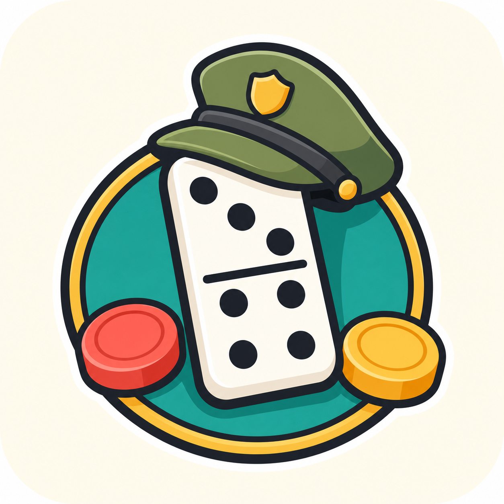

# Domino Hansip



Domino Hansip adalah game domino lokal berbasis Flutter dengan sistem batu khas permainan Hansip. Game ini mendukung mode VS Bot untuk bermain melawan 3 bot independen, serta mode Simulasi untuk mencatat permainan bersama pemain nyata.

Project ini berkembang dari pencatat permainan menjadi game utuh: ada pembagian kartu domino, giliran otomatis, papan domino visual, bot AI, pass, distribusi batu, pemenang ronde, Kepala Desa, Hansip, riwayat game, dan statistik pemain.

## Fitur Utama

- Pilih mode permainan: VS Bot atau Simulasi.
- Setup pemain, nama, avatar, dan jumlah batu awal.
- State game tersimpan lokal dengan Hydrated BLoC, sehingga permainan aktif bisa dilanjutkan setelah game ditutup.
- Alur stok batu berisi Batu Kecil dan Batu Besar.
- Catatan pass, distribusi batu, dan riwayat aksi permainan.
- Aturan Batu Besar hanya bisa dibagikan setelah Batu Kecil habis.
- Deteksi game buntu ketika semua pemain pass berturut-turut.
- Settlement ronde, Kepala Desa, Hansip, riwayat hasil, dan statistik pemain.
- Meja permainan responsif dengan kartu pemain, stok batu, tray distribusi, dan status giliran.

## Mode VS Bot

Mode VS Bot adalah mode game utama: 1 human melawan 3 bot independen. Setiap bot bertindak sebagai lawan sendiri, bukan tim.

Fitur VS Bot:

- Pembagian 7 kartu domino untuk tiap pemain.
- Ronde pertama dimulai dari kartu `6/6`.
- Giliran berjalan otomatis mengikuti urutan pemain.
- Bot berpikir dengan jeda natural sebelum memainkan kartu, pass, memilih penyebab pass, atau membagikan batu.
- Human hanya bisa memainkan kartu saat benar-benar gilirannya.
- Dialog pilihan kiri/kanan dicegah agar tidak bisa dipakai setelah giliran berubah.
- Jika ujung kiri dan kanan sama, pilihan kiri/kanan dilewati karena hasilnya setara.
- Papan domino memakai layout zig-zag compact agar rantai panjang tetap terbaca tanpa scroll horizontal panjang.
- Sambungan kartu dibuat overlap ringan supaya hubungan pip terlihat natural.

## Bot AI

Bot memakai engine rule-based dengan default difficulty `Expert`. Difficulty lain (`Easy`, `Normal`, `Hard`, `Expert`) sudah disiapkan di engine agar nanti bisa disambungkan ke UI pilihan tingkat kesulitan.

Expert bot saat ini:

- Tidak mengetahui isi kartu lawan.
- Hanya tahu kartu sendiri, rantai domino di meja, jumlah kartu pemain lain, dan riwayat pass.
- Menganggap semua pemain lain sebagai lawan, termasuk bot lain.
- Tidak bekerja sama dengan bot lain.
- Menilai semua move valid dengan scoring, bukan sekadar memainkan kartu pertama.
- Memilih kiri/kanan berdasarkan simulasi hasil ujung papan.
- Memprioritaskan membuang pip besar, terutama saat endgame.
- Menjaga peluang jalan berikutnya dengan mempertahankan ujung yang cocok dengan sisa kartu sendiri.
- Memakai pass history untuk menebak angka yang mungkin lemah bagi lawan.
- Berusaha menekan lawan yang jumlah kartunya tinggal sedikit.
- Menambahkan sedikit randomness ketika beberapa move nilainya hampir sama, supaya bot tidak terasa terlalu kaku.

## Aturan Yang Didukung

- Stok awal berisi 1 Batu Besar dan sisanya Batu Kecil.
- Nilai Batu Kecil adalah 1 poin.
- Nilai Batu Besar adalah 5 poin.
- Batu Besar hanya boleh dibagikan ketika pemain sudah tidak punya Batu Kecil.
- Jika stok masih ada dan pemain pass, pemain mengambil batu dari stok.
- Jika stok habis dan pemain pass, penyebab pass membagikan batu ke pemain yang pass jika masih memiliki batu.
- Dalam VS Bot, penyebab pass otomatis diambil dari pemain terakhir yang memainkan kartu.
- Game buntu terjadi ketika semua pemain pass berturut-turut; pemenang ditentukan dari total pip sisa kartu terkecil.
- Settlement menentukan pemenang ronde, perpindahan Kepala Desa, dan status Hansip.
- Hansip ditentukan dari pemain dengan poin tertinggi. Jika seri, aplikasi dapat meminta pilihan manual.

## Tech Stack

- Flutter
- Dart
- flutter_bloc untuk state management
- hydrated_bloc untuk persistensi state lokal
- equatable untuk value comparison
- google_fonts untuk typography
- uuid untuk ID data game dan action

## Struktur Project

```text
lib/
  app/                 Konfigurasi app, router, dan theme
  core/
    ai/                Bot turn action, pass causer, dan distribusi batu
    constants/         Konstanta aplikasi
    extensions/        Extension helper
    utils/             Rule helper dan domino engine
    widgets/           Reusable widgets
  data/models/         Model game, pemain, domino, action, history, settlement
  features/
    mode_select/       Pilihan mode permainan
    game_setup/        Setup mode simulasi
    vs_setup/          Setup mode VS Bot
    game_table/        Meja permainan VS Bot dan logic utama
    sim_table/         Meja mode simulasi
    round_settlement/  Settlement mode utama
    sim_settlement/    Settlement mode simulasi
    history/           Riwayat hasil game
    statistics/        Statistik pemain
    home/              Beranda dan lanjutkan game
    splash/            Splash screen
```

## Menjalankan Project

Pastikan Flutter SDK sudah terpasang, lalu jalankan:

```bash
flutter pub get
flutter run
```

Untuk memastikan kode bersih:

```bash
dart format lib
flutter analyze
```

Catatan: `flutter test` belum bisa berjalan karena folder `test/` belum tersedia di project ini.

## Asset

Logo aplikasi berada di:

```text
assets/images/app_logo.png
```

Asset tersebut sudah didaftarkan di `pubspec.yaml`.

## Status

Project ini adalah game mobile lokal Domino Hansip. Mode VS Bot menyediakan pengalaman bermain melawan 3 bot independen dengan AI fair berbasis inference, sedangkan mode Simulasi tetap tersedia untuk mencatat permainan bersama pemain nyata.
